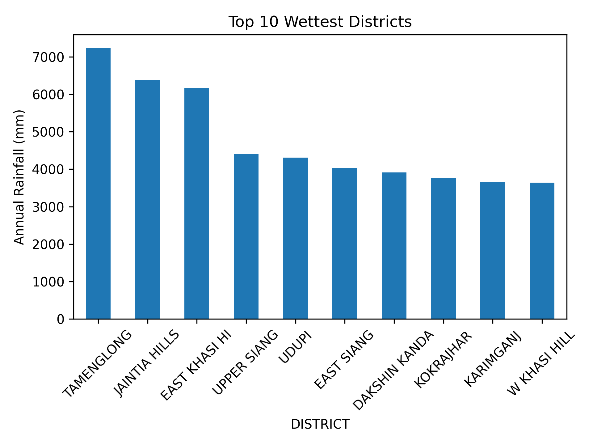

# 🌧️ Historical Monthly Rainfall Analysis of India (1901–2015)

This project is a **beginner-friendly hydrology data analysis** focused on **monthly and annual rainfall** in India's 36 meteorological sub-divisions.

> 📌 **Note:** This dataset is historical and does **not reflect recent climate trends**. The purpose of this project is to practice data analysis using real, publicly available environmental data.

---

## 📂 Dataset Overview

- **Time Period:** 1901 to 2015  
- **Granularity:** Monthly  
- **Coverage:** 36 Meteorological Sub-divisions in India  
- **Rainfall Unit:** Millimeters (mm)  
- **Source:** [India Meteorological Department (IMD)](https://goo.gl/uYbNWN)  
- **License:** CC BY-SA 4.0  
- **Acknowledgements:** Shared under Government Open Data License – India  

---

## 🔎 About This Project

This Python project performs basic exploratory data analysis and visualization on historical rainfall data.

### Features:

- Load and clean the rainfall dataset
- Analyze monthly, seasonal, and annual rainfall trends
- Identify the **Top 10 Wettest Districts** based on average annual rainfall
- Plot bar charts and save as image

---

## 📈 Output Sample

### Top 10 Wettest Districts (based on average annual rainfall):

---

## 📘 Files Included

- `Analysis_of_Historical_Rainfall.py` – Python script containing all the analysis steps
- `district_wise_rainfall_normal.csv` – The dataset (monthly rainfall from 1901 to 2015)
- `top10_wettest_districts.png` – Bar chart visualization saved from Python

---

## 🛠️ Tools Used

- Python (on Pydroid3 - Android)
- Pandas
- Matplotlib

---

## 💡 Learning Purpose

This project was created as part of learning:

- How to work with real-world datasets
- Python basics for data science
- Rainfall data analysis in hydrology
- Simple plotting and saving charts

---

## ⚖️ License

- **Dataset License:** [CC BY-SA 4.0](https://creativecommons.org/licenses/by-sa/4.0/)
- **Shared By:** India Meteorological Department (IMD), Govt. of India  
- **Dataset Link:** [https://goo.gl/uYbNWN](https://goo.gl/uYbNWN)

---

## 🙋 Author

Beginner Python & Hydrology Learner 🌱  
Project developed using **mobile phone (Pydroid3)** and open data!

---

✅ Feel free to explore, fork, or improve this repository. Educational use only.
